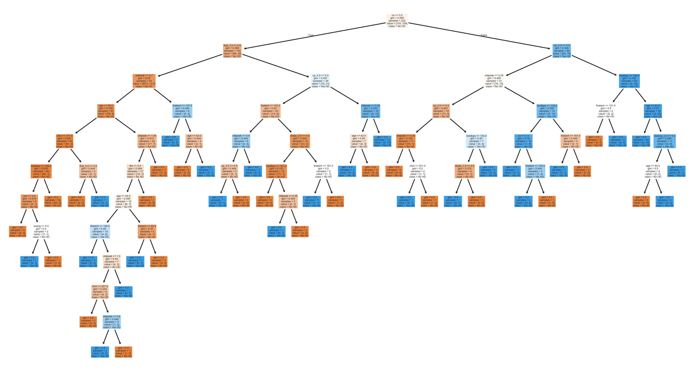
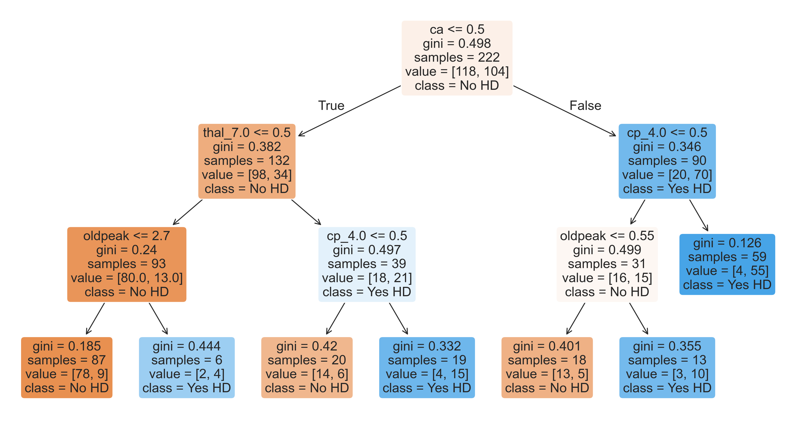

# Heart Disease Prediction using Decision Trees

This project applies machine learning to predict the presence of heart disease using the Cleveland Heart Disease dataset. 
The model leverages **Decision Tree Classifiers** for both interpretability and accuracy.

---

## 📌 Project Overview

The goal of this project is to:
- Preprocess the Cleveland Heart Disease dataset.
- Train a **Decision Tree Classifier** to identify key risk factors.
- Visualize the decision-making process of the model.
- Compare **original** vs **pruned** trees to prevent overfitting.

---

## 📂 Dataset

- **Source:** Cleveland Heart Disease dataset (`processed.cleveland.data`)
- **Target Variable:** Presence or absence of heart disease
- **Features:** Age, sex, chest pain type, resting blood pressure, serum cholesterol, fasting blood sugar, resting ECG results, maximum heart rate, exercise-induced angina, ST depression, slope, number of major vessels, thalassemia.

---

## 🛠️ Steps Performed

1. **Data Preprocessing**
   - Handled missing values.
   - Converted categorical variables.
   - Normalized numerical features.

2. **Model Training**
   - Used `DecisionTreeClassifier` from scikit-learn.
   - Tuned hyperparameters for maximum depth and minimum samples.

3. **Tree Visualization**
   - Plotted **Original Tree** for maximum interpretability.
   - Pruned the tree to avoid overfitting.

---

## 📊 Model Visualizations

### Original Decision Tree

---

### Pruned Decision Tree

---

## 📈 Results

- **Original Tree Accuracy:** High training accuracy but prone to overfitting.
- **Pruned Tree Accuracy:** Slightly lower training accuracy but better generalization.
- **Key Features Identified:** Chest pain type, number of major vessels, thalassemia, ST depression.

---

## 📌 Future Work
- Try ensemble methods like **Random Forest** or **XGBoost**.
- Perform feature selection for dimensionality reduction.
- Deploy model with **Streamlit** or **Flask**.

